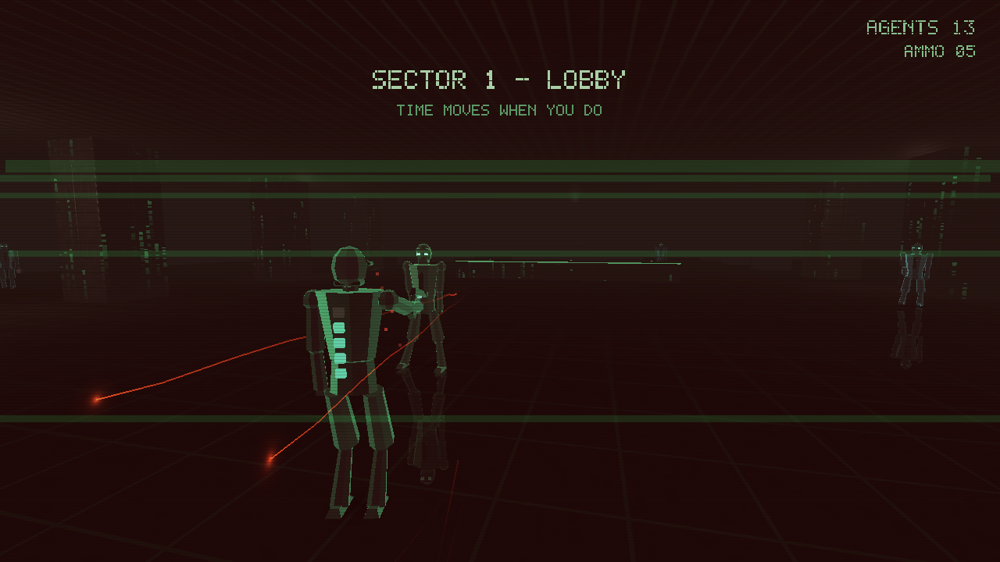

# DOPPLER

**Time moves when you move.**

A single-file SUPERHOT × *Matrix* homage in the demoscene tradition: one C file,
no assets on disk, no engine. Every texture, level, mesh, sound, and font is
synthesized at startup or runtime. Stripped down to immediate-mode OpenGL 2 and
SDL2, the whole game is one `doppler.c`.


## The gimmick

The simulation timescale follows **your** motion. Walk, look, or act and the
world runs at full speed; stand still and it freezes to a crawl — bullets hang
mid-air on oscilloscope trails. Everything that moves relative to you is shaded
by **Doppler shift**: blue approaching, red receding. Positional SFX detune and
pitch-bend with the frozen world while the music holds a steady groove.



## Features

- **Time-dilation core loop** — `tscale` eases toward your real-world motion;
  the world never fully stops (`MINTS` creep), so a round keeps drifting toward
  you even when you stand still.
- **Doppler shading** — agents, bullets, and shatter shards are tinted by their
  radial velocity relative to you: blue approaching, red receding.
- **Faceted crystal humanoids** — low-poly mannequins with flat-cut facets,
  emerald eyes, and a fresnel **rim glow** carrying the Doppler color on the
  silhouette.
- **Foot-planted locomotion** — the player runs on two-bone IK that keeps the
  stance foot from skating; agents' heads track you as you circle them.
- **Contact shadows & planar floor reflection** — figures grounded on the glossy
  obsidian floor; jumping lifts the shadow off.
- **Fake-bloom & emissive trim** — additive halos over eyes, the katana edge,
  and pickups; emerald edges outline the platforms.
- **Verticality & movement** — double jump, mid-air **wall-kick** rebounds, and
  a **dodge roll** under fire, over platforms, stairs, train roofs, and parkour
  climbs.
- **Deflect combat** — a charged pistol whose range grows as you move (find ammo
  to keep firing), plus a katana that one-shots close agents and **bats bullets
  back** at the nearest enemy in line of sight.
- **Synthesized soundtrack** — per-level driving trance (kick / hats / bass /
  supersaw arp / pad) generated live in the audio thread, with stereo positional
  SFX that pan and detune with the frozen world.
- **Four sectors** — `LOBBY`, `SUBWAY`, `TERMINAL`, and the `OVERLORD` boss
  finale, each with its own palette and lighting climate (`OVERLORD` reprises
  the `TERMINAL` track).

| Locomotion | Shatter | Katana |
| --- | --- | --- |
|  |  |  |

## Build & run

Requires SDL2 and OpenGL.

```sh
./build.sh        # clang on macOS, gcc on Linux
./doppler         # play
./doppler --level 2   # jump straight to a sector (0-based)
./doppler --seed 1234 # reseed the procedural levels
```

Or build by hand:

```sh
gcc -Os doppler.c -o doppler -lSDL2 -lGL -lm        # Linux
clang -Os doppler.c -o doppler -I/opt/homebrew/include -L/opt/homebrew/lib \
  -lSDL2 -framework OpenGL -lm                       # macOS (Homebrew SDL2)
```

## Controls

| Input | Action |
| --- | --- |
| `WASD` | Move (also charges the pistol's range) |
| Mouse | Look |
| `SPACE` | Jump — press again in the air for a double jump; into a wall to kick off |
| `SHIFT` / `CTRL` / `C` | Dodge roll |
| Left mouse | Fire (range grows the more you move) |
| Right mouse | Katana — kills up close, deflects bullets |
| `1`–`4` / `←` `→` | Select sector (title screen) |
| `ESC` | Sector select / quit |

Clear every agent in a sector to win.

## Regression mode

`./doppler --smoke` runs a fixed, deterministic choreography and writes six PPM
screenshots, then prints `SMOKE OK`. It forces `tscale=1` and fixed RNG seeds,
so output is byte-stable run-to-run — a cheap visual/behavioral regression gate
for refactors.

## License

CC0 / public domain. Greets to .theprodukkt and the SUPERHOT team.
