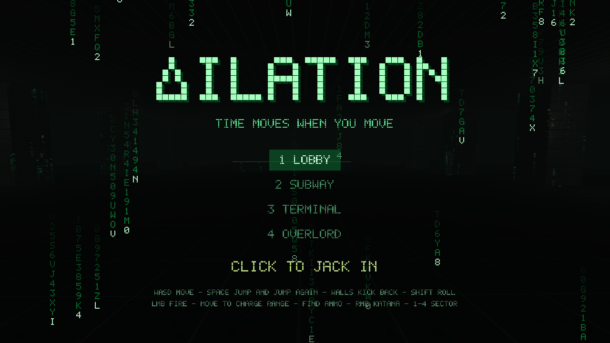
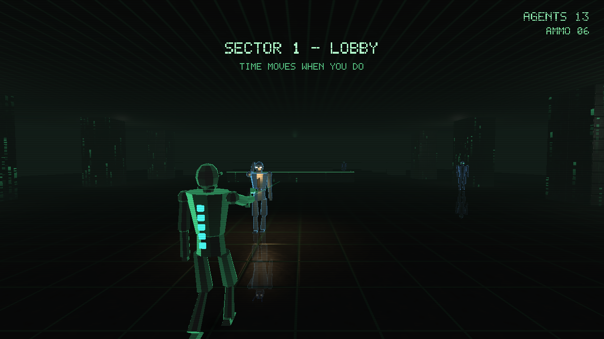
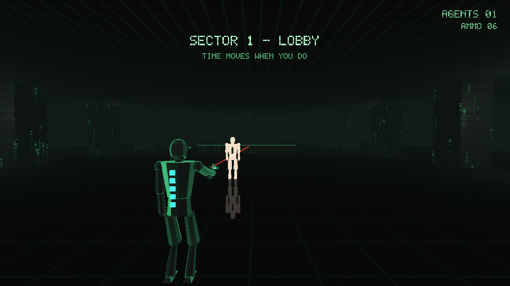
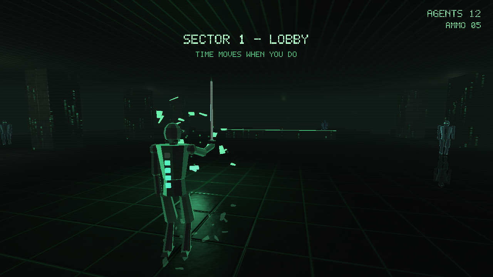
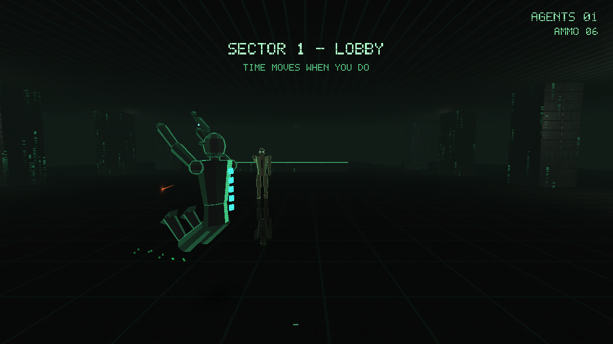
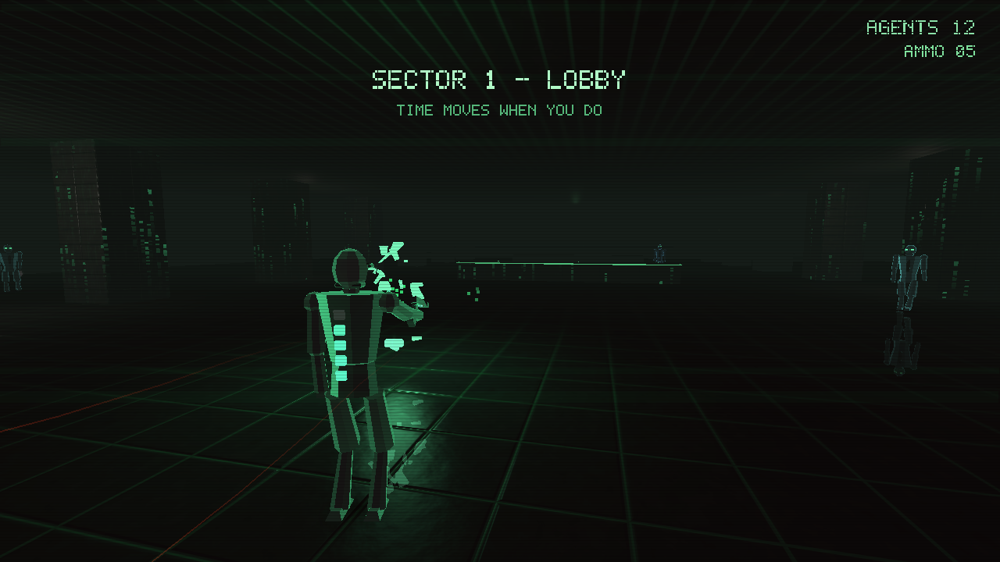

# DOPPLER

**Time moves when you move.**

A single-file SUPERHOT × *Matrix* homage in the demoscene tradition: one C file,
no assets on disk, no engine. Every texture, level, mesh, sound, and font is
synthesized at startup or runtime. Stripped down to immediate-mode OpenGL 2 and
SDL2, the whole game is one `.c` file and compiles to under ~150Kb.



| Features | Image |
| --- | --- |
| **Locomotion** - Run, dodge, double-jump or wall-kick your way around enemies and incoming fire. |  |
| **Pistol** - The laser pointer indicates where you're aiming but also charges as you move and dictates the distance you can shoot. Enemies will be highlighted when within range. |  |
| **Katana** - Deflect incoming bullets with your katana or take out enemies at close range. |  |
| **Dodge roll** - `SHIFT` / `CTRL` / `C` rolls you sideways evading enemy fire |  |
| **Shatter** - Defeating enemies sometimes leaves behind health packs or ammo. |  |


## Build & run

Requires SDL2 and OpenGL.

```sh
./build.sh        # clang on macOS, gcc on Linux
./doppler         # play
./doppler --level 2   # jump straight to a sector (0-based)
./doppler --seed 1234 # reseed the procedural levels
```

Or build by hand:

```sh
gcc -Os doppler.c -o doppler -lSDL2 -lGL -lm        # Linux
clang -Os doppler.c -o doppler -I/opt/homebrew/include -L/opt/homebrew/lib \
  -lSDL2 -framework OpenGL -lm                       # macOS (Homebrew SDL2)
```

## Controls

| Input | Action |
| --- | --- |
| `WASD` | Move (also charges the pistol's range) |
| Mouse | Look |
| `SPACE` | Jump — press again in the air for a double jump; into a wall to kick off |
| `SHIFT` / `CTRL` / `C` | Dodge roll |
| Left mouse | Fire (range grows the more you move) |
| Right mouse | Katana — kills up close, deflects bullets |
| `1`–`4` / `←` `→` | Select sector (title screen) |
| `ESC` | Sector select / quit |

Clear every agent in a sector to win.

## Regression mode

`./doppler --smoke` runs a fixed, deterministic choreography and writes nine PPM
screenshots, then prints `SMOKE OK`. It forces `tscale=1` and fixed RNG seeds,
so output is byte-stable run-to-run — a cheap visual/behavioral regression gate
for refactors.

## License

CC0 / public domain.
